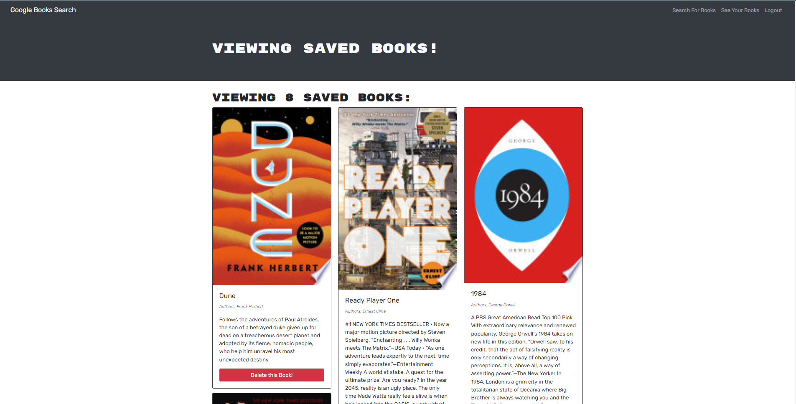

# You Can't Disappoint a Picture

# Description
I took a fully functioning Google Books API search engine built with a RESTful API and refactored it to be a GraphQL API built with Apollo Server using mongoDB and hosted on heroku. Live site demo: [Click Me!](https://you-cant-disappoint-a-picture.herokuapp.com/)

# Technologies Used 
- MongoDB 
- Express.js
- React
- Node.js
- Mongoose
- Apollo
- GraphQL

# Usage

Uses Google Books API to search for books. When logged in you can save books to keep an organized list of books that you would like to read in the future. Once read, you can delete the individual books off of your list and add more, there is no limit to the amount of books that you can save to your profile.

# License

> This project is using the MIT license.
